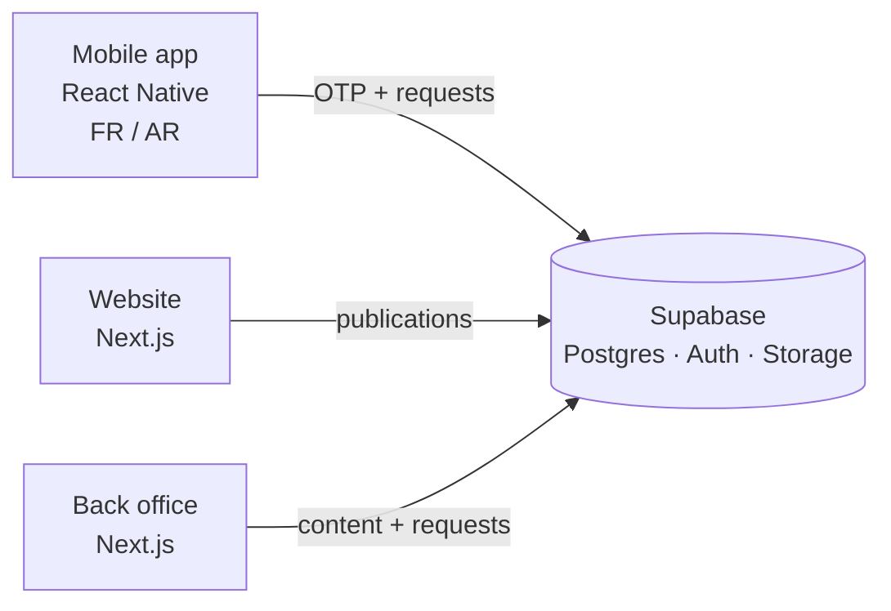

# MSPI

  

MSPI is the official digital platform of Chad's Ministry of Public Security and Immigration. It connects citizens to the ministry through a bilingual (French / Arabic) mobile app, a public website, and a back office that lets ministry staff manage everything themselves. The whole thing replaced a paper process where getting an official publication out used to take days - now it's under 10 minutes.

The app is live on the Play Store as the ministry's official app.

## Links

- 📱 Mobile app: [Google Play](https://play.google.com/store/apps/details?id=td.gov.mspi.app)
- 🌐 Website: [securitepublique-tchad.org](https://www.securitepublique-tchad.org)

> The source code is private (government property). Happy to walk through the architecture and the tricky parts in an interview.

## What it does

- Citizens submit and track requests from their phone, with history and push notifications
- OTP authentication (no passwords to leak)
- Full French / Arabic support, including right-to-left layout
- A back office where ministry teams publish content and handle requests on their own, without a developer in the loop
- A public website for official communications

## Architecture

Supabase handles auth, data and storage so the whole system stays lean - one source of truth for the mobile app, the website and the back office. The interesting design constraint was making the back office simple enough that non-technical ministry staff could run the platform themselves, which is what actually killed the multi-day publication delay.

## Screenshots

  
  &nbsp;
  

